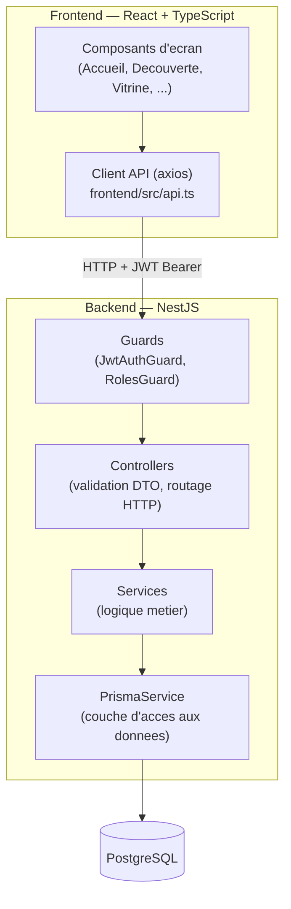
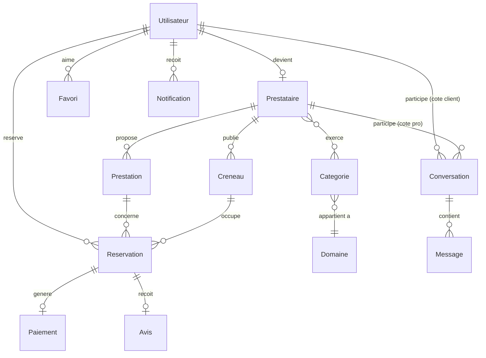
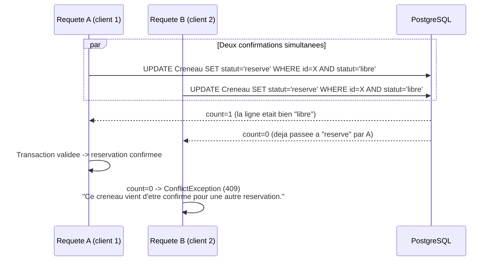

# Architecture logicielle — KWIIK

> Document de référence pour la conception technique du projet : architecture en couches, indépendance vis-à-vis du mode de stockage, normes de qualité appliquées, et un exemple concret de traitement fiable d'un cas concurrent réel.

## 1. Vue d'ensemble

KWIIK suit une architecture client-serveur classique en couches, avec une séparation stricte entre présentation, logique métier et accès aux données :



**Indépendance vis-à-vis du mode de stockage.** Les services métier (`ReservationsService`, `PrestatairesService`, etc.) n'exécutent jamais de requête SQL directe : ils passent systématiquement par `PrismaService`, qui encapsule l'accès aux données derrière un client typé généré à partir du schéma (`backend/prisma/schema.prisma`). Changer de moteur de base de données (PostgreSQL → un autre SGBD relationnel supporté par Prisma) n'impacterait que la chaîne de connexion et le schéma, jamais la logique métier des services — c'est la définition même d'un service d'accès aux données indépendant du mode de stockage.

## 2. Normes de qualité appliquées

| Norme / pratique | Application concrète dans KWIIK |
|---|---|
| Validation des entrées à la frontière | Chaque endpoint reçoit un DTO annoté `class-validator` (ex. `InscriptionDto`, `CreerReservationDto`) — aucune donnée non validée n'atteint la couche service. |
| Séparation des responsabilités (SoC) | Controller (HTTP) → Service (métier) → Prisma (données), jamais de logique métier dans un controller. |
| Principe de moindre privilège | `JwtAuthGuard` protège toute route sensible ; `RolesGuard` + `@Roles('admin')` restreint les actions d'administration (ex. `PATCH /prestataires/:id/verifier`). |
| Sécurité des données au repos | Mots de passe hachés avec `bcrypt` (jamais stockés en clair), jamais renvoyés dans une réponse API (voir incident corrigé en §4). |
| Contraintes d'intégrité en base | Clés étrangères avec `onDelete: Cascade` cohérent, contraintes `@@unique` (ex. `Favori`, `Conversation`, `Utilisateur.email`) empêchant les doublons au niveau base plutôt qu'en applicatif uniquement. |
| Programmation orientée objet / typée | TypeScript strict des deux côtés, classes de service injectées par DI (NestJS), DTOs typés bout en bout jusqu'au frontend. |

## 3. Modèle de données (diagramme entité-association)



## 4. Fiabilité : traitement d'un cas concurrent réel

**Contexte.** Deux clients peuvent tenter de réserver le même créneau au même instant (ex. deux onglets ouverts, ou deux appareils). Sans protection, les deux requêtes pourraient toutes les deux réussir, créant une double réservation.

**Solution appliquée** (`backend/src/reservation/reservations.service.ts`, méthode `confirmer`) : une transaction Prisma interactive avec des `updateMany` conditionnels, qui exploitent les contraintes de la base plutôt qu'un verrou applicatif fragile.



Ce mécanisme a été vérifié par un test de charge réel : 8 requêtes de confirmation envoyées simultanément sur le même créneau — exactement 1 a réussi, les 7 autres ont reçu un `409 Conflict` propre (voir `docs/PLAN_DE_TESTS.md`, cas de test CT-01).

### 4.1 Modification d'un algorithme existant sans régression

La méthode `confirmer()` n'a pas été écrite ainsi dès le départ : elle existait déjà et fonctionnait pour le cas nominal, mais laissait passer le cas concurrent ci-dessus. La modifier sans casser son comportement existant a demandé de préserver trois choses : la signature de la méthode, le contrat de retour (même forme de réservation renvoyée), et tous les appelants (contrôleur HTTP, frontend) inchangés.

**Avant** (logique séquentielle, sans protection) :
```ts
async confirmer(utilisateurId: string, reservationId: string) {
  const { reservation } = await this.chargerPourPrestataire(utilisateurId, reservationId);
  // ... verifications metier ...
  await this.prisma.creneau.update({
    where: { id: reservation.creneauId },
    data: { statut: 'reserve' },
  });
  return this.prisma.reservation.update({
    where: { id: reservationId },
    data: { statut: 'confirmee' },
    include: { prestation: true, creneau: true },
  });
}
```
Deux requêtes `update()` simples (sans clause `WHERE` sur l'état courant) : si deux confirmations arrivent en même temps, **les deux réussissent**, le créneau se retrouve doublement réservé.

**Après** (transaction interactive + garde conditionnelle) :
```ts
return this.prisma.$transaction(async (tx) => {
  const creneauVerrouille = await tx.creneau.updateMany({
    where: { id: reservation.creneauId, statut: 'libre' },
    data: { statut: 'reserve' },
  });
  if (creneauVerrouille.count === 0) {
    throw new ConflictException("Ce créneau vient d'être confirmé pour une autre réservation.");
  }
  // ... memes verifications metier, memes annulations des demandes concurrentes ...
  return tx.reservation.findUniqueOrThrow({
    where: { id: reservationId },
    include: { prestation: true, creneau: true },
  });
});
```
La différence clé : `updateMany` avec `statut: 'libre'` dans la clause `WHERE` fait de la base de données elle-même l'arbitre de la concurrence (`count === 0` signifie qu'une autre requête a gagné la course), au lieu de faire confiance à un `update()` qui réussit toujours et de vérifier l'état *après coup*.

**Preuve de non-régression** : le cas nominal (une seule confirmation) produit exactement le même résultat qu'avant — même type de retour, même code HTTP `200`, aucun appelant modifié. Seul le cas concurrent, qui échouait silencieusement avant, est désormais rejeté explicitement. Vérifié par le cas de test CT-01 (`docs/PLAN_DE_TESTS.md`).

## 5. Incident de sécurité corrigé (traçabilité)

Lors de la refonte de l'authentification (passage téléphone/OTP → email/mot de passe), un audit a révélé que le hash bcrypt du mot de passe était renvoyé tel quel dans les réponses de `/auth/inscription`, `/auth/connexion`, `/auth/apple-simule` et `/utilisateurs/moi`. Correction : une fonction `sansMotDePasse()` filtre systématiquement ce champ avant toute sérialisation JSON, et un `select` Prisma explicite exclut `motDePasseHash` des requêtes `GET`/`PATCH` sur `/utilisateurs/moi`. Voir `docs/GESTION_DES_RISQUES.md` pour le classement de ce risque dans la matrice projet.
