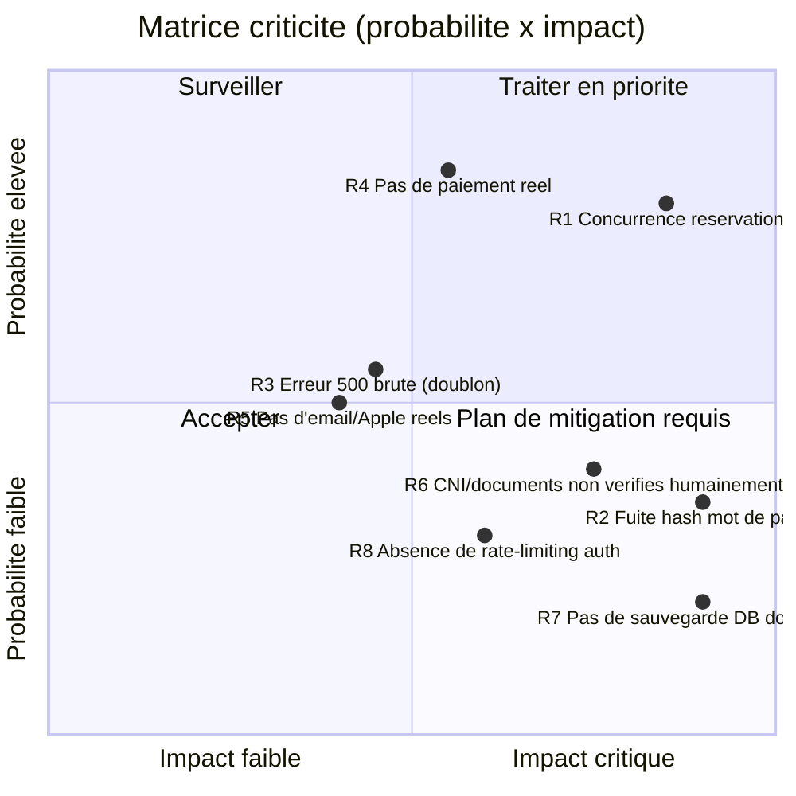

# Gestion des risques — KWIIK

> Registre des risques du projet : identification, probabilité, impact, criticité et mesures de prévention/mitigation. Construit à partir de risques réels rencontrés ou identifiés sur ce projet, pas d'un modèle générique.

## 1. Méthode

Chaque risque est noté sur deux axes (échelle 1 à 3) :
- **Probabilité** : 1 = faible, 2 = moyenne, 3 = élevée
- **Impact** : 1 = mineur, 2 = significatif, 3 = critique (perte de données, faille de sécurité, indisponibilité)

**Criticité = Probabilité × Impact.** Un risque ≥ 6 doit être traité avant mise en production ; un risque ≥ 4 doit avoir un plan de mitigation documenté ; en dessous, il est accepté et surveillé.

## 2. Matrice des risques

## 3. Registre détaillé

| ID | Risque | Prob. | Impact | Criticité | Statut | Mesure prise / prévue |
|---|---|---|---|---|---|---|
| R1 | Double réservation sur un même créneau en cas de requêtes simultanées | 3 | 3 | **9** | ✅ Traité | Transaction Prisma interactive + `updateMany` conditionnels (voir `docs/ARCHITECTURE.md` §4). Vérifié par test de charge (8 requêtes simultanées → 1 succès, 7 rejets propres). |
| R2 | Hash bcrypt du mot de passe renvoyé dans les réponses API (`/auth/*`, `/utilisateurs/moi`) | 3 | 3 | **9** | ✅ Traité | Fonction `sansMotDePasse()` + `select` Prisma explicite excluant `motDePasseHash`. Trouvé et corrigé pendant la refonte de l'authentification, avant toute mise en production. |
| R3 | Doublon de téléphone/email provoquant une erreur 500 brute au lieu d'un message utilisateur clair | 2 | 2 | **4** | ✅ Traité | Interception `PrismaClientKnownRequestError` (code `P2002`) → `ConflictException` avec message explicite. |
| R4 | Aucun paiement réel connecté (Orange Money / MTN MoMo) | 3 | 3 | **9** | ⚠️ Accepté (choix produit) | Décision explicite : paiement simulé pour l'instant, flux complet mais sans appel opérateur réel. À lever avant toute commercialisation réelle — nécessite des identifiants opérateur. |
| R5 | Confirmation d'email et connexion Apple simulées (pas de fournisseur réel) | 2 | 2 | **4** | ⚠️ Accepté (choix produit) | Même principe que le mock SMS d'origine. Documenté comme hors périmètre dans `docs/CAHIER_DES_CHARGES.md` §10. |
| R6 | CNI et documents professionnels (licence, facture d'électricité) uploadés mais jamais vérifiés par un humain | 3 | 2 | **6** | ⚠️ À traiter avant lancement | Le moteur de documents dynamique collecte les bons justificatifs (voir cahier des charges §3) mais aucune revue manuelle/automatique de leur validité n'existe encore. Nécessite un processus de modération avant ouverture publique. |
| R7 | Aucune procédure de sauvegarde/restauration de la base PostgreSQL documentée | 3 | 3 | **9** | ❌ Non traité | À documenter avant mise en production : fréquence de sauvegarde, rétention, test de restauration. |
| R8 | Absence de limitation du nombre de tentatives sur `/auth/connexion` (hors code de confirmation qui, lui, est limité à 5 tentatives) | 2 | 3 | **6** | ❌ Non traité | Le code de confirmation email a déjà un compteur de tentatives (`MAX_TENTATIVES = 5`) ; la connexion par mot de passe n'a pas encore d'équivalent (risque de force brute). Recommandation : `@nestjs/throttler` sur `/auth/connexion`. |

## 4. Risques clos par construction (pas de plan nécessaire)

Ces risques, courants sur ce type de projet, sont déjà neutralisés par des choix d'architecture pris dès le départ, pas ajoutés après coup :

- **Injection SQL** : Prisma paramètre systématiquement les requêtes ; aucune requête SQL brute concaténée n'existe dans le code.
- **Validation d'entrée manquante** : chaque endpoint utilise un DTO `class-validator` ; une requête malformée est rejetée avant d'atteindre la logique métier.
- **Accès non autorisé aux ressources d'autrui** : chaque service vérifie la propriété de la ressource (ex. modification d'une prestation, accès à une conversation) avant d'agir, pas seulement l'authentification.
