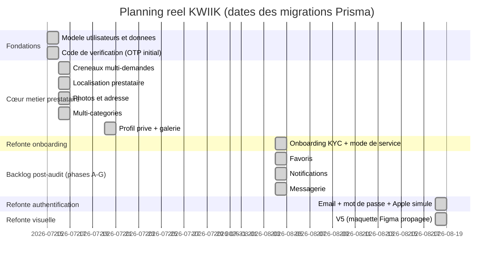
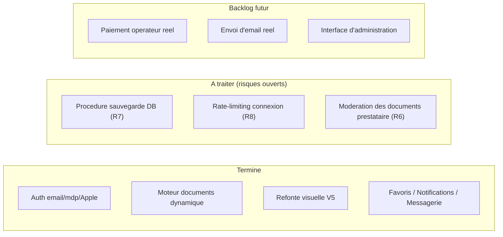
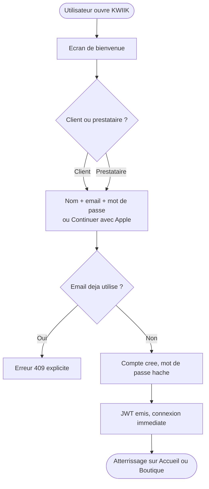
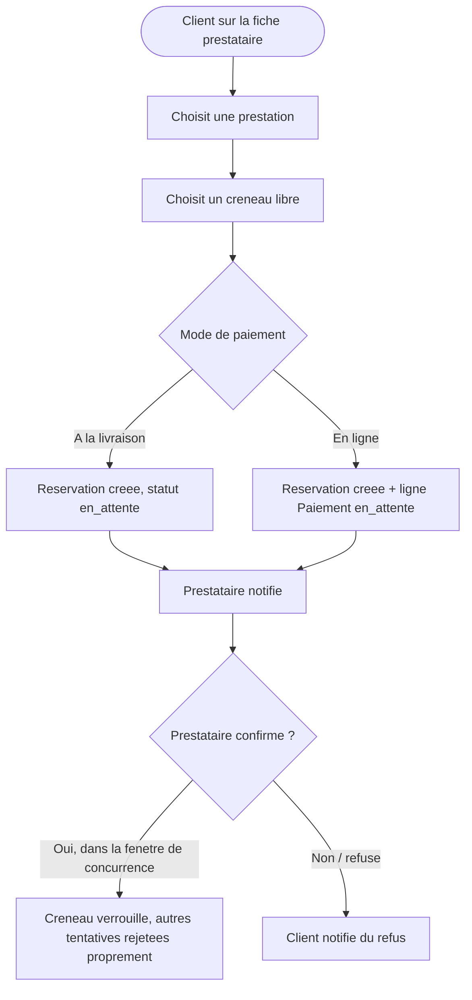
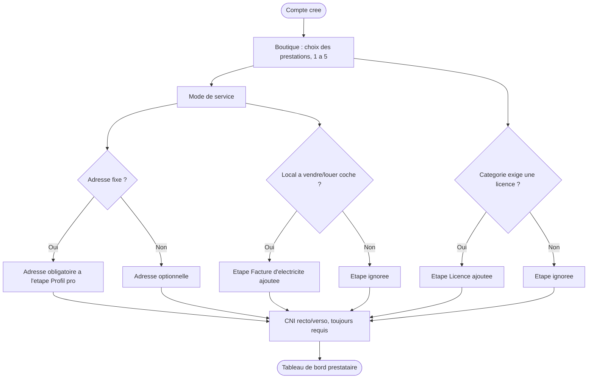

# Gestion de projet Agile — KWIIK

> Pilotage DevOps du développement : méthodologie, backlog, planning, gestion des compromis coûts/délais/qualité/risques, et procédures utilisateurs formalisées avec leurs résultats attendus. Reconstruit à partir de l'historique réel du projet (migrations de base de données, commits), pas d'un exemple générique.

## 1. Méthodologie et organisation

KWIIK est développé par un **développeur unique** (conception, code, tests, documentation) — il n'y a pas d'équipe de développement à coordonner. Le pilotage Agile ici ne consiste donc pas à répartir des tâches entre développeurs, mais à structurer le travail solo en incréments vérifiables et à interagir avec une **équipe de communication distincte**, en charge de la vulgarisation et de la promotion du projet à partir de son lancement (voir §5.1).

KWIIK est piloté en cycles courts de type **Scrum allégé** : chaque cycle livre un incrément fonctionnel vérifiable (compilation propre + test de bout en bout réel avant de passer au suivant), avec un point de contrôle explicite validé avant d'enchaîner sur le cycle suivant — pas de développement en silo sur plusieurs semaines sans revue.

Trois contraintes sont arbitrées à chaque cycle :
- **Coûts** : pas de dépendance à un service payant tant que la valeur n'est pas démontrée (paiement, email, SMS : tous simulés jusqu'à preuve de traction).
- **Délais** : cycles volontairement courts (un cycle = une fonctionnalité livrable), pour détecter les dérives tôt plutôt qu'en fin de projet.
- **Qualité** : aucun cycle n'est considéré terminé sans vérification de compilation (`tsc --noEmit`) ET un test de bout en bout réel (navigateur, pas juste unitaire) — voir `docs/PLAN_DE_TESTS.md`.

## 2. Planning réel du projet (reconstruit depuis les migrations de base de données)

## 3. Backlog produit (epics → user stories)

| Epic | User stories (extrait représentatif) | Statut |
|---|---|---|
| Authentification | En tant qu'utilisateur, je veux créer un compte par email/mot de passe ou Apple pour accéder à KWIIK sans dépendre d'un numéro de téléphone. | ✅ Livré |
| Onboarding prestataire | En tant que prestataire, je veux qu'on me demande uniquement les documents pertinents pour mon activité (licence, facture d'électricité) pour ne pas être bloqué par des démarches inutiles. | ✅ Livré |
| Réservation fiable | En tant que client, je veux être certain qu'un créneau réservé ne peut pas être attribué deux fois. | ✅ Livré |
| Paiement | En tant que client, je veux pouvoir choisir de payer en ligne ou à la livraison. | ✅ Livré (simulé) |
| Messagerie | En tant que client, je veux contacter un prestataire directement depuis sa fiche. | ✅ Livré |
| Découverte | En tant que client, je veux filtrer les prestataires par prix, note et mode de service. | ✅ Livré |
| Refonte visuelle | En tant que porteur de projet, je veux une identité visuelle professionnelle alignée sur une maquette de référence. | ✅ Livré (V5) |

## 4. Tableau Kanban (état actuel)

## 5. Procédures utilisateurs formalisées et résultats attendus

### 5.1 Interaction avec l'équipe de communication

Le développeur unique n'est pas isolé : une équipe de communication, distincte de l'équipe technique (ici, réduite à une personne), est chargée de la vulgarisation et de la promotion du projet à partir de son lancement. Cette équipe ne lit pas le code — elle consomme la documentation produit (`docs/CAHIER_DES_CHARGES.md` en priorité) pour construire son discours externe (grand public, prestataires à recruter, partenaires locaux).

Cela impose une contrainte concrète sur la façon dont la documentation est rédigée : chaque document produit (cahier des charges, ce document de gestion de projet, l'audit d'accessibilité, etc.) doit rester compréhensible par un interlocuteur non-développeur, avec un vocabulaire fonctionnel avant technique — c'est la raison pour laquelle chaque document de ce projet commence par un paragraphe de contexte en langage clair avant d'entrer dans le détail technique. C'est une application directe de l'adaptation du discours à l'auditoire (décideurs, futurs utilisateurs, partenaires) plutôt qu'à un seul public de développeurs.

Formaliser une procédure, c'est documenter le déroulé réel *et* le critère qui permet de dire qu'elle a réussi — pas juste décrire l'écran.

### 5.2 Inscription et connexion

**Résultat attendu** : un compte est créé en moins de 3 étapes, sans blocage sur une pièce d'identité côté client ; en cas d'email déjà utilisé, l'utilisateur reçoit un message actionnable (pas un code d'erreur brut). Vérifié par test de bout en bout (voir `docs/PLAN_DE_TESTS.md`, cas CT-04).

### 5.3 Réservation d'une prestation

**Résultat attendu** : aucune double réservation possible sur un même créneau, quel que soit le nombre de tentatives simultanées ; le client est notifié à chaque changement de statut. Vérifié par test de charge réel (8 requêtes concurrentes, voir `docs/ARCHITECTURE.md` §4).

### 5.4 Devenir prestataire (moteur de documents dynamique)

**Résultat attendu** : seuls les documents pertinents pour l'activité choisie sont demandés — pas de licence exigée pour un métier qui n'en a pas besoin, pas de facture d'électricité demandée à un prestataire sans local à vendre/louer. Vérifié par test de bout en bout avec la catégorie "Esthétique" (licence requise) + case "local à vendre/louer" cochée (voir `docs/PLAN_DE_TESTS.md`, cas CT-06).

## 6. Clôture et validation (rappel des pratiques déjà en place)

Chaque livraison de cycle suit un même protocole de clôture, aligné sur les bonnes pratiques CFTL de recette : compilation vérifiée des deux côtés (backend/frontend), scénario de bout en bout rejoué dans un navigateur réel, et un point de contrôle explicite communiqué avant de considérer le cycle terminé (voir les points de contrôle successifs documentés dans l'historique de ce projet).
