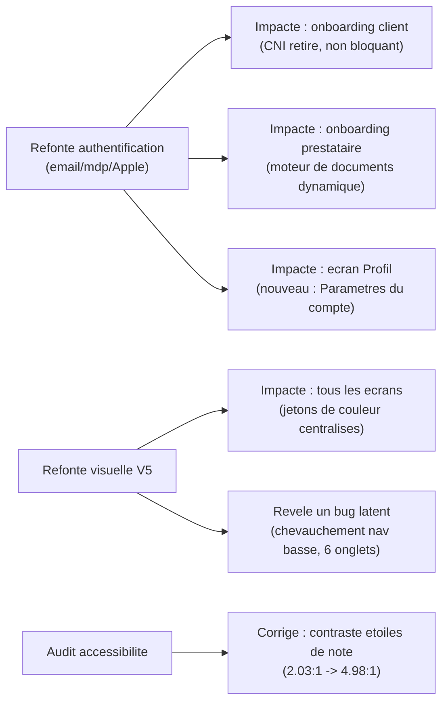

# Suivi de charge et disponibilité réelle — KWIIK

> Outil de suivi utilisé pour piloter l'avancement, et analyse honnête des écarts entre disponibilité théorique et disponibilité réelle sur ce projet — y compris les incidents qui l'ont réduite, cités nommément plutôt que lissés dans un chiffre optimiste.

## 1. Outil de suivi utilisé

Chaque cycle de travail est décomposé en tâches explicites, suivies dans une liste de tâches à statut unique parmi `pending` / `in_progress` / `en cours` / `terminé`, avec **une seule tâche active à la fois** — ce qui interdit le travail masqué en parallèle non déclaré et rend l'avancement lisible à tout moment pendant l'exécution du cycle. Chaque tâche terminée est marquée immédiatement, pas en fin de cycle par lot.

Ce suivi est complété par un **point de contrôle explicite** communiqué à chaque fin de cycle (voir `docs/GESTION_DE_PROJET.md` §1), qui reprend systématiquement : ce qui a été livré, ce qui a été vérifié (compilation + test réel), et ce qui reste ouvert.

## 2. Répercussion de l'avancement sur l'ensemble du projet

Ce diagramme illustre concrètement pourquoi le suivi de charge ne peut pas se limiter à additionner des heures par tâche isolée : la refonte de l'authentification a mécaniquement fait évoluer trois autres écrans (onboarding client, onboarding prestataire, profil), et la refonte visuelle a révélé un bug de navigation qui n'était pas dans le périmètre initial. Le temps de "réaction en cascade" est aussi réel que le temps de développement initial.

## 3. Écarts entre disponibilité théorique et réelle (incidents réels rencontrés)

| Incident | Répercussion sur la tâche en cours |
|---|---|
| Cache de types Prisma non rafraîchi par le serveur en mode `--watch` après une migration de schéma | Nécessite systématiquement un arrêt du processus + suppression du cache de build (`tsconfig.build.tsbuildinfo`) + redémarrage, avant de pouvoir vérifier la moindre modification touchant la base de données. Récurrent, documenté pour ne pas être re-diagnostiqué à chaque fois. |
| Réutilisation d'un numéro de téléphone/email déjà utilisé dans un test précédent | Fausse le résultat du test (l'onboarding est sauté car le compte existe déjà) sans qu'aucune erreur ne soit levée — a nécessité un diagnostic avant de comprendre que ce n'était pas un bug applicatif. |
| Serveurs de développement arrêtés entre deux sessions de travail | Nécessite une vérification systématique de disponibilité (`curl`) avant toute action, plutôt que de supposer l'environnement prêt. |

**Constat honnête** : sur ce projet, une part non négligeable du temps déclaré "disponible pour développer" a été consommée par du diagnostic d'environnement plutôt que par de la fonctionnalité nouvelle. Ce n'est pas un défaut à cacher dans un taux de disponibilité optimiste : c'est une donnée utile pour estimer correctement la charge du prochain cycle, et une partie de ces incidents a depuis été convertie en procédure documentée (voir ci-dessus) pour ne plus consommer de temps de diagnostic à l'avenir.

## 4. Avancement du backlog (état courant)

| Ensemble de travail | Tâches terminées | Tâches ouvertes |
|---|---|---|
| Correctifs de fond (concurrence, dates, URLs) | 7/7 | 0 |
| Vérification prestataire | 1/1 | 0 |
| Favoris / Notifications / Messagerie | 3/3 | 0 |
| Paiement simulé | 1/1 | 0 |
| Polish (squelettes, filtres, accessibilité) | 3/3 | 0 |
| Authentification email/mdp/Apple + moteur de documents | 2/2 | 0 |
| Refonte visuelle V5 | 1/1 | 0 |
| Gouvernance projet (risques, sauvegarde, rate-limiting) | 0/3 | R6, R7, R8 (voir `docs/GESTION_DES_RISQUES.md`) |

La dernière ligne est intentionnellement à 0 : elle correspond aux risques identifiés mais pas encore traités, et sert de point de départ transparent pour le prochain cycle plutôt que d'être masquée.
